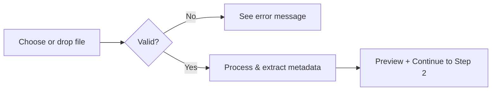

# Step 1: Upload Video — Guide

This guide walks you through **Step 1** of Sprite Smithy: uploading your AI-generated character video so you can convert it into a sprite sheet. It’s for anyone using the tool for the first time or needing a quick reference for the upload step.

## Prerequisites

- A video file of your character (e.g., from an AI video generator).
- Supported format: **MP4**, **WebM**, or **MOV**.
- File size **under 100MB**; recommended duration **up to 10 seconds** for best results.
- The app running locally or deployed (e.g., open `/tool` in your browser).

## Overview

Step 1 validates your file, loads it into the app, and extracts metadata (duration, FPS, dimensions, frame count). On success, you can review the video and continue to **Loop Selection** (Step 2).

## Step-by-step

### Step 1: Open the tool

1. Start the app (e.g., `npm run dev`) and go to the tool page (typically **/tool**).
2. Ensure **Step 1 — Upload Video** is selected in the left sidebar. It’s the first step by default when you open the tool.

### Step 2: Upload your video

You’ll see the upload area with the heading **Upload Your Video** and the line **Upload an AI-generated character video to begin**. The main content area has a large dashed-border drop zone with a cloud-upload icon, the text **Drop your video here** / **or click to browse**, and the line **Supports MP4, WebM, MOV • Max 100MB • Max 10 seconds**. The left sidebar lists all 7 steps with **Upload Video** (step 1) selected.

To add a screenshot to this guide: capture the Step 1 screen at [http://localhost:3000/tool](http://localhost:3000/tool) and save it as `docs/assets/guides/step-1-upload/step-1-upload-empty.png`.

Do **one** of the following:

- **Drag and drop**: Drag your video file onto the dashed area and release. The area highlights when you drag over it.
- **Click to browse**: Click anywhere inside the dashed area to open a file picker, then choose your video (MP4, WebM, or MOV).

While the file is processing, you’ll see **Loading video...** and **Please wait while we process your video**.

### Step 3: Check for errors (if any)

If the file isn’t accepted:

- A red error box appears below the upload area with a short message.
- **Unsupported format**: Use MP4, WebM, or MOV.
- **File too large**: Compress or shorten the video so it’s under 100MB.

Fix the issue and try uploading again.

### Step 4: Review and continue

After a successful upload:

- The heading changes to **Video Uploaded Successfully** and you see **Review your video and continue to the next step**.
- A **video player** shows your clip with playback controls.
- A **metadata card** shows:
  - File name and size  
  - Duration, FPS, dimensions, total frames  

You can:

- **Upload Different Video**: Use the outline button to pick another file (same rules apply).
- **Continue to Loop Selection**: Use the primary button to go to Step 2.

## Flow summary

| Action              | Result                                              |
|---------------------|-----------------------------------------------------|
| Drop or select file | Validation runs (format + size).                   |
| Valid file          | Metadata is extracted; preview and metadata appear. |
| Invalid file        | Error message shown; correct and retry.             |
| Continue            | App moves to Step 2 (Loop Selection).              |

## Troubleshooting

| Issue                     | What to do                                                |
|---------------------------|-----------------------------------------------------------|
| “Unsupported file format” | Save or export the video as MP4, WebM, or MOV.           |
| “File too large”          | Reduce resolution, length, or re-encode to stay under 100MB. |
| Upload seems stuck        | Refresh the page and try again; ensure the file isn’t corrupted. |
| No video after upload     | Check the browser console for errors; try a different file or format. |

## Related code

- **Component**: `src/components/steps/Step1Upload.tsx` — upload UI, drag-and-drop, and preview.
- **Upload logic**: `src/hooks/useVideoUpload.ts` — validation, `setVideoFile`, metadata extraction.
- **Validation**: `src/utils/file.ts` — `validateVideoFile()` (format and 100MB limit).
- **Constants**: `src/utils/constants.ts` — `SUPPORTED_VIDEO_EXTENSIONS`, `MAX_VIDEO_SIZE`, `MAX_VIDEO_DURATION`.
